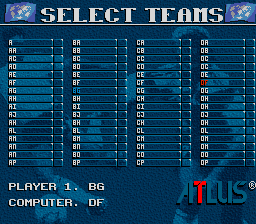
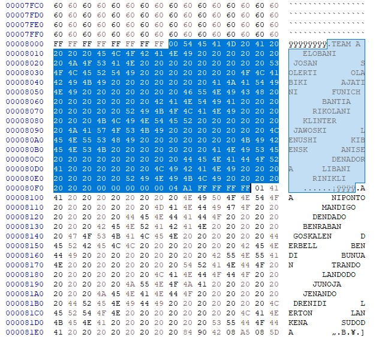

## World Soccer 94 - Road to Glory - Team Save

Rom hack for the SNES game World Soccer 94 - Road to Glory 
It adds the possibility to edit teams and keep the changes even when reloading the game.
 
The original game team editor has a 28 teams limit. 
The latest version of the patch allows to edit all 64 teams. 

### How it works

The patch adds SRAM to the game. 

The first time the game is loaded it will fill the sram with xFF in 710000-717FFF 
and write some default bytes in x700000 (12 28). The bytes are just a marker to prevent subsequent loading from erasing the SRAM.
The rest of the modifications change the RAM address for the team editing to the sram address 710000. 
Most emulators nowadays save the SRAM in a .srm file that can be copied for backup or edited with an hexadecimal editor: 

The format is in this order as follows: 

bytes | data | info
--- | --- | ---
1 | team id | 0x00 = Israel 0x01 = Algeria 0x3F = Wales 
10 | team name | 
224 | player names | 16 players per team x 14 letters per name
7 | team kit | the different parts of the kit affect different bits
4 | padding | 0xFF 0xFF 0xFF 0xFF

Data starts at 0x8000 with 0xF6 bytes per team.

### Rom to patch

Database match: World Soccer 94 - Road to Glory (USA) 
Database: No-Intro: Super Nintendo Entertainment System (v. 20210222-050638) 
File/ROM SHA-1: D1CF0B5659FC4139B079EB7B80080ED7D4D7C04B 
File/ROM CRC32: AAE0A10 

### BPS Patch

Newest Version: 
[Download World Soccer 94 - Road to Glory (USA) - Super Edit.zip](https://github.com/Krokodyl/world-soccer-94/raw/main/patch/World%20Soccer%2094%20-%20Road%20to%20Glory%20(USA)%20-%20Super%20Edit.zip)

Tested on snes9x-1.61-win32-x64 and bsnes v115

